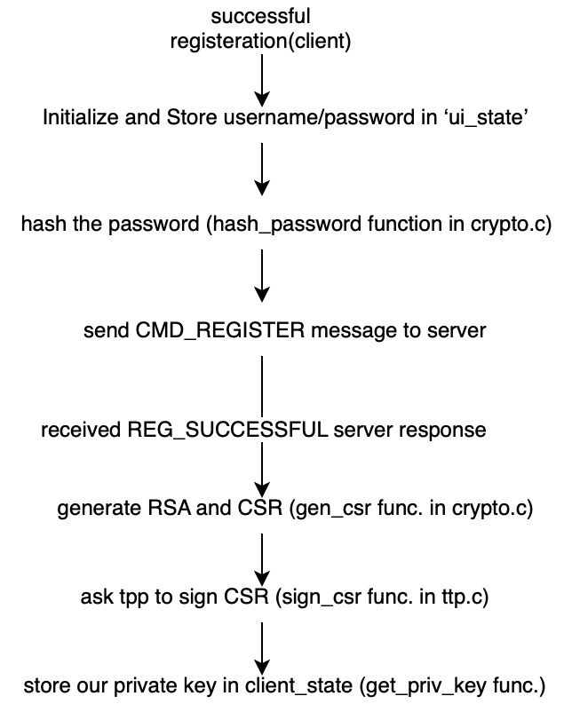
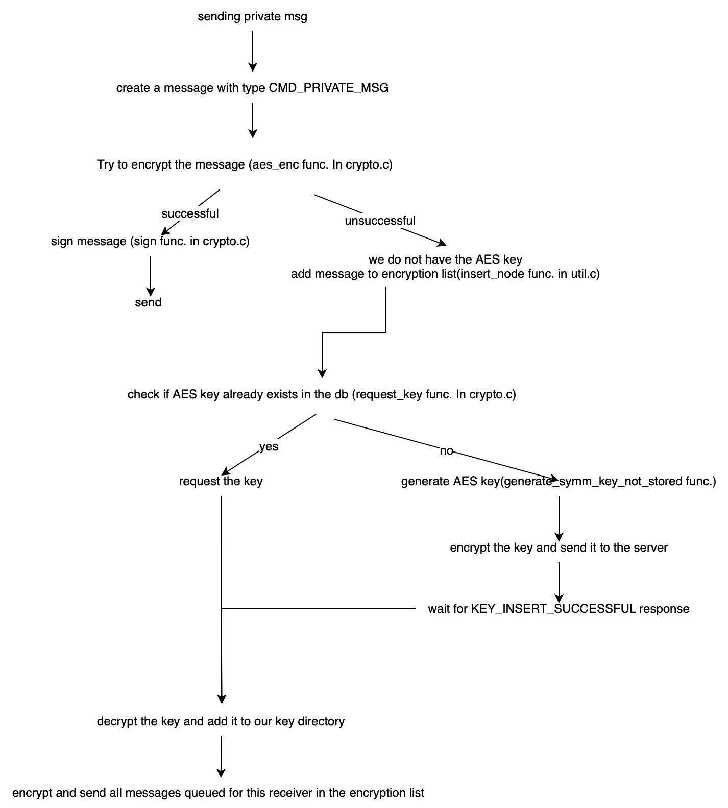

## Setup
To run the code, first navigate to the appropriate directory. Then, run the following code with the TCP port number of your choosing.
```
make all
./server port
./client localhost port
```

Note: The server and ttp's certificates and keys are created via the makefile on
the make all command.

## Description of commands:
- register:
    - /register username password
- login: 
    - /login username password
- users: /users
    - this command is used to get a list of online users. user must be logged in to use this command.

- private message:
    - after logging in, users can send private messages to other users by typing @ followed by receiver's username.
- exit: 
    - to exit the program, users can type /exit or hit ctrl+D


  <br /> 
## Overview of message types exchanged:

```
struct api_msg
{
  enum cmd_type type;
  char time[20];
  unsigned char sig[256];
  union {
      struct public_msg publicMsg;
      struct private_msg privateMsg;
      struct auth auth;
      struct users users;
      struct server_response serverResponse;
      struct key_exchange keyExchange;
  };

};
```
```
enum cmd_type
{
    CMD_LOGIN = 0,
    CMD_PRIVATE_MSG = 1,
    CMD_PUBLIC_MSG = 2,
    AES_KEY_INSERT= 3,
    AES_KEY_REQUEST= 4,
    CMD_REGISTER= 5,
    CMD_USERS=6,
    SERVER_RESPONSE=7
};
```
<br /> 

### possible messages sent to users from server:
```
enum response{
    REG_SUCCESSFUL,
    LOGIN_SUCCESSFUL,
    INVALID_CREDENTIALS,
    CMD_NOT_AVAILABLE,
    USER_NOT_FOUND,
    USER_DOES_NOT_MATCH,
    USERNAME_EXISTS,
    INVALID_CMD_FORMAT,
    INVALID_USR_LEN,
    INVALID_PSW_LEN,
    ALREADY_LOGGED_IN,
    KEY_ALREADY_EXISTS,
    KEY_NOT_FOUND,
    KEY_INSERT_SUCCESSFUL,
    INVALID_MSG_LEN,
    BAD_SIGNATURE,
    INVALID_CHR_IN_USR

};
```
<br /> 

## Database:
<br /> 

The database contains 3 tables:

1. **users**
    - *columns:* username, salt, hash, status
    - there is a *unique* constraint on the username
2. **keys**
    - *columns:* user1, user2, key, iv, signature
    - there is a *unique* constraint on the pair of user1,user2
3. **messages**
    - *columns:* id, timestamp, message, sender, receiver, type, signature, length

## example Control flows:
<br />

### Successful registration (client side):

<br />

### Successful registration (server side):
<br />

- Generate random salt (generate_salt func. In crypto.c)
-	Hash the password (hash_salt_password function in crypto.c)
o	This function uses SLOW_HASH_ROUNDS macro (defined in cmd.h) 
-	Store salt/hash in the db (register_user func.)
-	Send REG_SUCCESSFUL response to user
<br />

### sending private message:
<br />


<br />

## Cryptography:

* Clients establish an SSL connection to the server and use CA's
certificate to validate the server's identity. SSL provides confidentiality and
integrity of the connection to the server.

* after successful registeration, clients create a CSR and ask ttp to create the certificate. additionally, they store the hash of the password in their clientkey's direcory. this will be used to authorize access to the client's keys.

* all functions that read/write files validate the paths (provided usernames). 
calls to ssl command are done using fork/execv.

* when receiving certificate of other users, clients check if the certificate is propperly signed by the CA, and if the username (that we used to request this cert) matches the common name of the certificate.

* for login/register commands, the password is hashed on the client side before sending it to the server.
    * on the server side, the password is hashed with a random salt (for 1000 rounds) and are stored in the databse.This prevents attacker from obtaining passwords (cleartext) if the server is compromised.

* AES keys generated by the clients are encrypted with receivers public key (RSA) and stored in the database.
    * additionally, we encrypt the AES key with our own public key and store that in the db as well. this allows clients to recover AES keys if deleted, or use the program in another machine(only private key is needed).
the key_exchange message (used to send the keys) is signed and the signature is stored in the db. signature is verified on the server before storing keys, as well as on the client side when requesting the keys from the server.

* Both public and private messages are signed by the sender using the
private key. Server verifies the signature before storing the message in
the database and notifying other workers. Clients verify the signature as well. This provides
integrity and non-repudiation even if the server is compromised.
    * Additionally, private messages are encrypted using AES symmetric key
which prevents server from reading private messages.
